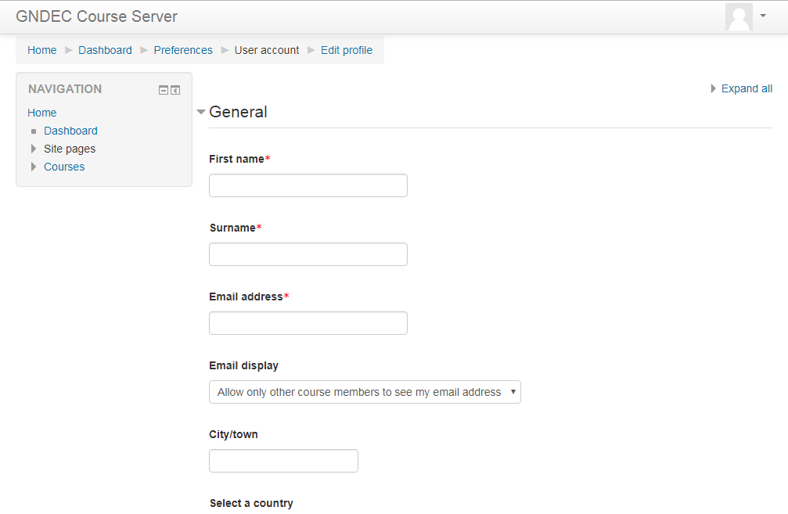

<link rel = "stylesheet" href = "style/intro.css">

<link rel = "stylesheet" href = "https://www.w3schools.com/w3css/4/w3.css">

<a href="https://greatdevelopers.github.io/ScriptCAD" class="w3-bar-item w3-button">Home</a>
<a href="https://goo.gl/forms/YeDk8IqOeDLKQOtB2" class="w3-bar-item w3-button">Register Here</a>

<button class="w3-button">Menu</button>

<a href="https://goo.gl/forms/YeDk8IqOeDLKQOtB2" class="w3-bar-item w3-button">Register Here</a>
<a href="https://groups.google.com/forum/#!forum/greatbim" class="w3-bar-item w3-button">Mailing List</a>
<a href="https://greatdevelopers.github.io/ScriptCAD/Payment.html" class="w3-bar-item w3-button">Transaction Details</a>
<a href="https://greatdevelopers.github.io/ScriptCAD/FAQ.html" class="w3-bar-item w3-button">FAQs</a>
<a href="https://greatdevelopers.github.io/ScriptCAD/Terms.html" class="w3-bar-item w3-button">Terms & Conditions</a>

<button class="w3-button">Sessions</button>

<a href="https://greatdevelopers.github.io/ScriptCAD/Session0/Session0.html" class="w3-bar-item w3-button">Session-0</a>
<a href="https://greatdevelopers.github.io/ScriptCAD/Bishop_Tutorial.html" class="w3-bar-item w3-button">Session-1</a>

# Frequently Asked Questions

## 1. Why CSE/IT students should join?

By joining this course you get to explore new programming language, which is in high demand in these days.
For getting to know the uses of python, listen to the [creators](https://www.python.org/about/apps).
Not just new programming language but to know the field where programming language has its practical application (FreeCAD here).
Also as an additional benefit, you get to know about simple the game development, using python.

## 2.  Why Civil/ Mech/ Elec/ Electronics/ Production students should join?

i) Mech, Civil and Production : Usefull for them as for designing purpose of machines/buildings, the can use FreeCAD, Solid Modelling which are being taught here.
ii) Electronics and Electrical: Learn to design circuits using FreeCAD.
Python is the language that is used in data science, one can do computer graphics through it, popular frameworks for web development are written in python like Django, Flasj, Pylons etc. Most importantly it is used in artifical intelligence.

## 3. Why M.Tech. Student should join?

(Master students will understand the need of learning a computer language for their thesis work)
- In case of ME, CE or any core branch, modeling is an essential part of research and learning CAD is their basic need.
- For CSE it will be related to image processing, like counting bricks, and generating the 3D models.
- Learn how to create models with script in lesser time.
- [More reasons](https://www.stat.washington.edu/~hoytak/blog/whypython.html)

## 4. What is the meaning of lifetime?

Lifetime means, during their student life. 
A normal educational course extends around 4 years, so we your college student life spans 4 years.
Hence, the 4 years' support is lifetime support.

## 5. How are we going to provide after course support?

When we say after course support, we meant to say that we will be helping you even after the course has ended.
Though the time period for which we provide help depends on your choice of the course.
Exactly how this help will be provided to you will become clear during the course.

## 6. How to enroll for course on guru.gndec.ac.in?

* If you are GNDEC student, then login into https://guru.gndec.ac.in using your internet access credentials.

* If you are not student of GNDEC, then you can also login as guest.

* Now you will be welcomed with following dialogue box.

* Fill here your complete details.

* Confirmation email will be sent to your email address. Open your mail and click on confirmation link. 

* Now paste this link in your browser https://guru.gndec.ac.in/course/view.php?id=102 

* In administration panel click on "Enroll me in this course" as shown below.

* Enter enrollment key as specified on [Mailing List](https://groups.google.com/forum/#!forum/greatbim)

* Congrats, you are enrolled for course.

*For further queries contact 8847351424 or 8198090674*
