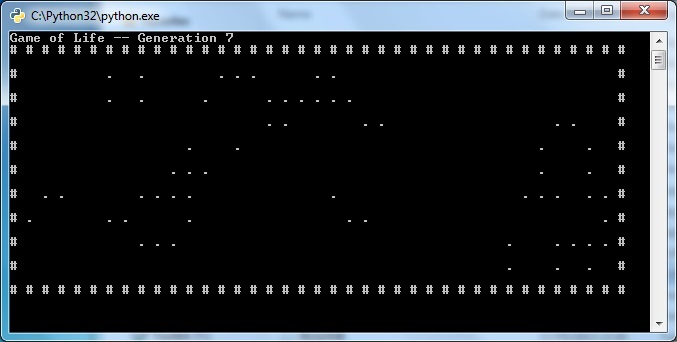
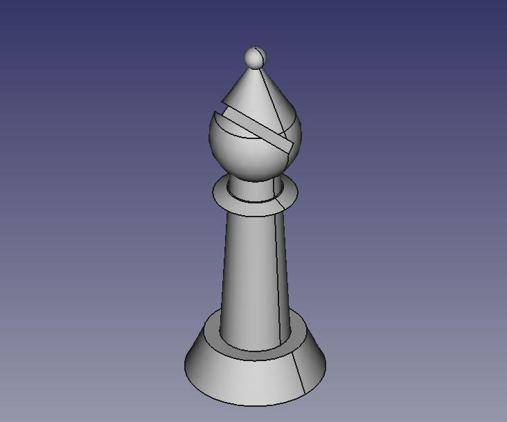
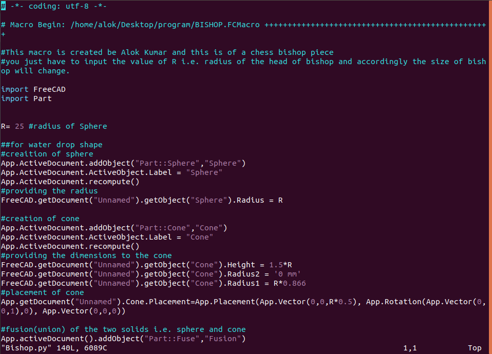
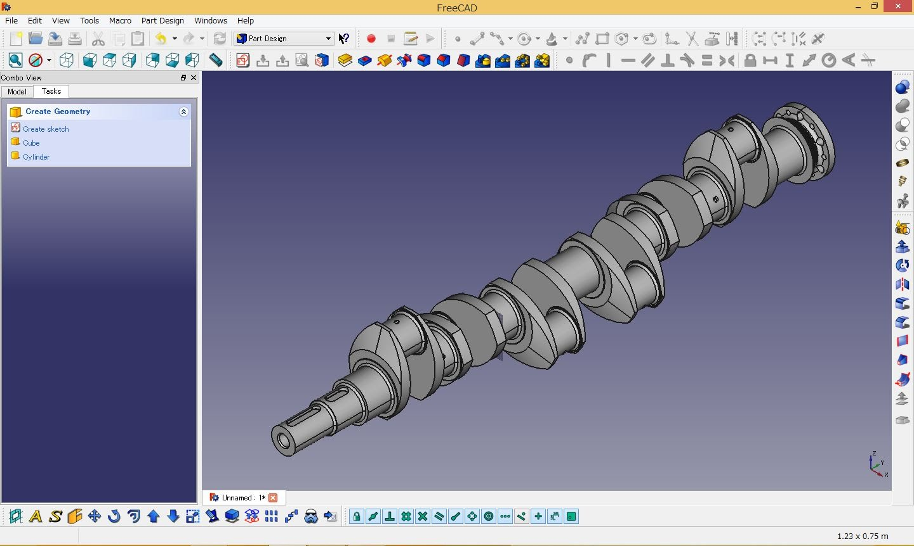

<link rel = "stylesheet" href = "style/intro.css">

<link rel = "stylesheet" href = "https://www.w3schools.com/w3css/4/w3.css">

<a href="https://greatdevelopers.github.io/ScriptCAD" class="w3-bar-item w3-button">Home</a>
<a href="https://goo.gl/forms/YeDk8IqOeDLKQOtB2" class="w3-bar-item w3-button">Register Here</a>

<button class="w3-button">Menu</button>

<a href="https://goo.gl/forms/YeDk8IqOeDLKQOtB2" class="w3-bar-item w3-button">Register Here</a>
<a href="https://groups.google.com/forum/#!forum/greatbim" class="w3-bar-item w3-button">Mailing List</a>
<a href="https://greatdevelopers.github.io/ScriptCAD/Payment.html" class="w3-bar-item w3-button">Transaction Details</a>
<a href="https://greatdevelopers.github.io/ScriptCAD/FAQ.html" class="w3-bar-item w3-button">FAQs</a>
<a href="https://greatdevelopers.github.io/ScriptCAD/Terms.html" class="w3-bar-item w3-button">Terms & Conditions</a>

<button class="w3-button">Sessions</button>

<a href="https://greatdevelopers.github.io/ScriptCAD/Session0/Session0.html" class="w3-bar-item w3-button">Session-0</a>
<a href="https://greatdevelopers.github.io/ScriptCAD/Bishop_Tutorial.html" class="w3-bar-item w3-button">Session-1</a>

<button class="w3-button">Feedback</button>

<a href="https://goo.gl/forms/ucznhnQxVDul4HYW2" class="w3-bar-item w3-button">Session-0</a>

# Solid Modelling with Python

*Testing and Consultancy Cell (TCC), GNDEC, in association with Great Developers (GD) & Great Civil Engineers (GCE), presents a unique way to learn more in less time, less effort and less fee.*

## Less Time, More Learning

Welcome all!

This is a high powered capsule course meant to teach you a wide range of practical stuff in very little time using a computer.

By joining this course you will learn :

1. Computer Programming: Python
1. Game development
1. Solid Modeling: FreeCAD
1. Engineering Drawing: Way to produce 2D drawings.
1. And much more ...

And all of this in mere 6 hours that will be spread over a week for your comfort.

**Dates :** 9/10/18 to 13/10/18

**Venue :** TCC Seminar Hall

**Fee:** Flexible ( Scroll down for complete fee structure )

**After-course support:** Life time*

**Attendance:** Optional*

Recommended for every smart engineer who wish to empower herself/himself to produce 3D solid models automatically.

## Course Instructor

**Prof. Dr. Hardeep Singh Rai**

Dean (TCC)

## Prerequisites

Well, we are ready to give you all that we have, but then we also expect somethings from you which are :
 
* Basic use of computer (Typing and printing document, Internet browsing)
* Exposure to any Computer Language (can be compensated if they opt for Monday session)
* **Attitude of self-learner**

## Course Schedule

The 6 hours will be spread over the week like this :

### 8th Oct [Monday] {Optional Extra Dish}

**4 pm to 5 pm**

Basics of python - For those who don’t know even a single programming language           

- Program structure
- Data type
- Expressions
- Arrays
- Control Structure and
- Functions

### 9th Oct [Tuesday]

**4 pm to 5 pm**

- Introduction to 3D Solid Modelling software (FreeCAD)
- Making 3D Bishop (Chess Piece) through GUI

### 11th Oct [Thursday]

**4 pm to 5pm**

- Introduction to macro in freeCAD
- Making the python script to automatically create Bishop/House of given specifications.

### 13th Oct [Saturday] 

**9 am to 1 pm**

- Making ED sheets using python in FreeCAD.
- Creating solid models, mechanical parts like gears and buildings.

## Fee Structure

 Student Type | Certificate preference | Course Fee | + Basic Python Course | After Course Support | Total Payable Fee | Concession Granted
--- | --- | --- | --- | --- | --- | --- |
GNDEC Students | Without Certificate | Rs 600 | + Rs 400 | 1 month | Rs 1000 | 80% | 
"               | With Certificate |  Rs 1500 | + Rs 300 | 2 month | Rs 1800 | 64% |
Other Students | Without Certificate|  Rs 3000 | + Rs 200 | 2 years | Rs 3200 | 36% |
"               | With Certificate |  Rs 5000 | + Rs 0 | 4 years | Rs 5000 | 0% |  

[Transaction Details](/Payment.md)

